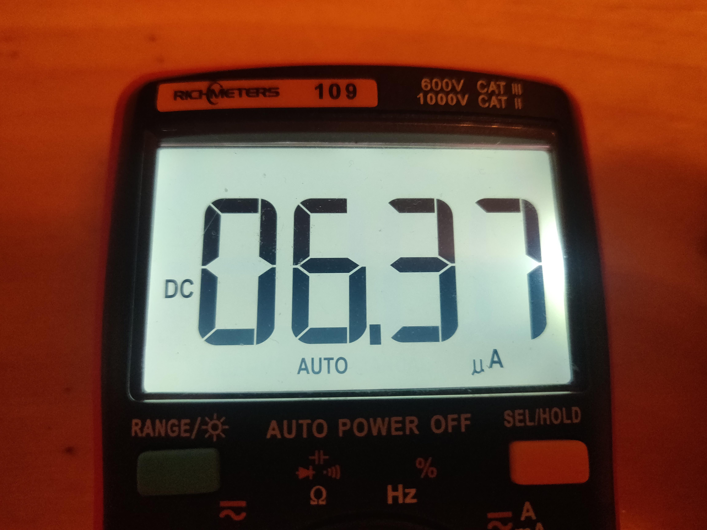

# 15 Режим низкого потребления

Для выполнения этой работы вам потребуется амперметр. Его необходимо подключить вместо перемычки JP2. Таким образом мы будем измерять общее потребление микроконтроллера по шинам Vdd, Vdda, Vbat. Принципиальную схему discovery можно посмотреть в документации к плате.

В этой работе рассмотрим 5 режимов потребления и пример программы которая осуществляет переход между ними.

## Базовые принципы

Энергопотребление ядра зависит от частоты квадратично, те P ≈ f^2. Потребление периферии не так очевидно и может зависеть от многих параметров. К примеру, если мы питаем светодиод через push-pull вывод.

Настраивается EXTI прерывание по кнопке USER.

После каждого нажатия будем сбрасывает таймер в ноль, будет считать что нажатие на кнопку это какое-то внешнее событие которое нужно обработать и после этого вероятны другие события. Это похоже на ток, как вы работаете с компьютером. Пока вы активны, он активен. Если же долго не нажимать на кнопки и не двигать мышкой, то он перейдет в режим сна.

Т.к. P = UI, а U = const, то P ≈ I. Измерим ток до изменения изменением делителя.

После инициализации МК переходит в "боевой" - Run режим на частоте 48МГц, которую мы используем обычно. Измерим потребление в этом режиме. У меня получилось от (10-12)mА. Если мы питаемся от аккумулятора 3000mA/hour то, его хватит всего на 3000/10 = 300 часов работы, что мало.

### Работа на низкой частоте

После инициализации стартует таймер. Таймер отсчитывает заданное кол-во времени, по умолчанию 3с и генерирует прерывание. В обработчике реализован выбор режима дифайном. Нужно задать режим в начале main.c.

```c
// select one of this modes

#define LOW_FREQ
//#define SLEEP
//#define STOP
//#define STANDBY
```

Выберем LOW_FREQ. В этом режиме частота работы уменьшается путем увеличения делителя. Нужно помнить что в этом режиме не только ухудшается производительность но и становится не корректной работа периферии, зависимой от частоты. Итоговая частота будет 48МГц / 512. У меня получилось потребление около 2мА, те устройство сможет работать в 5 раз дольше чем в режиме RUN.

```c
#ifdef LOW_FREQ
    // set 512 prescaler
    LL_RCC_SetAHBPrescaler(LL_RCC_SYSCLK_DIV_512);
```  

При нажатии на кнопку USER ( pa0 ) генерируется прерывание в котором мы сконфигурируем RCC, тем самым снова работаем на 48Мгц и потребляет около 10мА.

```c
void EXTI0_1_IRQHandler()
{
#ifdef LOW_FREQ
    // reinit RCC
    rcc_config();
```

### Sleep

Выберем режим sleep.

```c
#elif defined(SLEEP)
    // enable clock for PWR
    LL_APB1_GRP1_EnableClock(LL_APB1_GRP1_PERIPH_PWR);
    // select sleep after exiting last interrupt
    LL_LPM_EnableSleepOnExit();
    // enable events and interrups for waking up
    LL_LPM_EnableEventOnPend();
    // enable sleep mode
    LL_LPM_EnableSleep();
    
    // going to sleep // waiting for interrupt mode
    __WFI();
```

Теперь тактирование ядра будет остановлено, но периферия продолжит работу. Потребление в этом режиме оказалось 5mA.

### Stop

В этом режиме достигается баланс между потреблением и возможностью МК быстро возобновить работу.

```c
#elif defined(STOP)
    // enable clock for PWR
    LL_APB1_GRP1_EnableClock(LL_APB1_GRP1_PERIPH_PWR);
    // enable deep sleep modes
    LL_LPM_EnableDeepSleep();
    // select low power voltage regulator
    LL_PWR_SetPowerMode(LL_PWR_MODE_STOP_LPREGU);
    
    // going to sleep // waiting for interrupt mode
    __WFI();
```

Выход производится нажатием pa0. После выхода необходимо переконфигурировать систему тактирования. В зависимости от выбранного регулятора напряжения можно достичь либо более быстрый выход из режима, либо более низкое потребление энергии. У меня получилось 6.37uA. В этом режиме аккумулятора нам хватит на 3000/ 0.00637 = 470'957 часов, что более 55 лет.



### StandBy

Это самый экономичный режим. Он похож на stop, но выход возможен c выполнением процедуры init. Те, после выхода из этого режима мк оказывается в состоянии аналогичном состоянию после перезагрузки, но с выставленным битом, сигнализирующем нам о том, что мк был в режиме сна. У меня получилось 3.84uA.

#### PS

Можно оценить потребление энергии с помощью встроенного в CubeMx калькулятора. К примеру, расчеты показывают что в режиме standby потребление будет таким.


В нашем случае оно оказалось близко к расчетному.

Т.к модуль swg( необходим для загрузки прошивки и отладки ) тоже потребляем энергию, даже в режиме standby, то чтобы достичь указанных значений тока, необходимо после прошивки обесточить МК и подать питание снова.

##### Дз

Построить график потребления МК в зависимости от рабочей частоты и кол-ва активной периферии.
